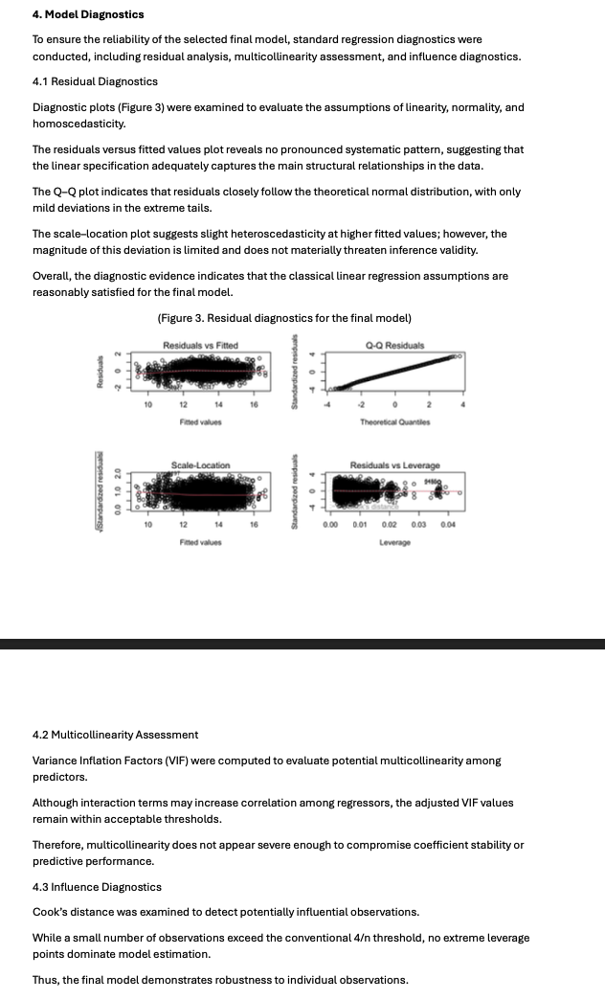

# House Price Prediction (Kaggle Project)

## Visualization

## Overview
This project investigates the determinants of residential housing prices and builds predictive models using multiple linear regression.  
The goal is to improve prediction accuracy and understand key factors influencing housing values.

## Results
- Kaggle Ranking: Top 15  
- RMSE: 1,184,578  

## Methods
- Log transformation of SalePrice to stabilize variance  
- Feature engineering (e.g., TotalSF, TotalBath)  
- Multiple linear regression with interaction terms  
- Model selection using AIC  
- Model evaluation using 10-fold cross-validation  

## Key Findings
- Living area and basement size significantly increase housing prices  
- The effect of size is stronger in higher-quality homes (interaction effect)  
- Higher-quality properties generate greater returns from additional space  

## Model Diagnostics
- Residual analysis shows no major violation of linear assumptions  
- Q-Q plots indicate approximate normality  
- VIF values suggest no severe multicollinearity  

## Tools
- R (ggplot2, dplyr)

## Report
Full report available here:  
[View Report](report.pdf)
